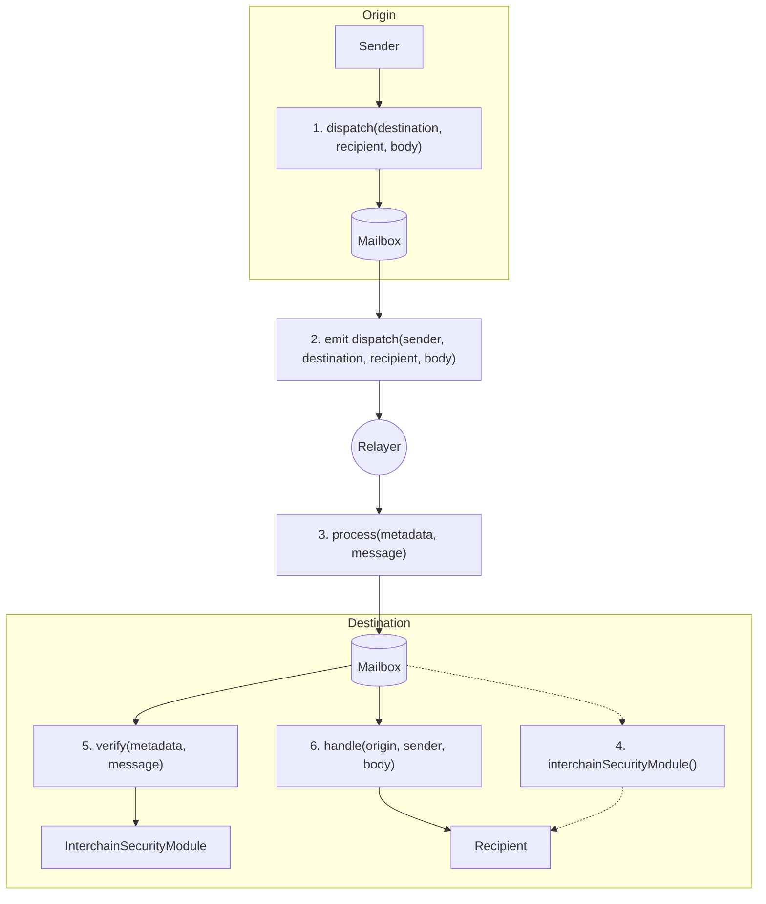

# Hyperlane Protocol

## Introduction {: #introduction }

[Hyperlane](https://hyperlane.xyz/){target=\_blank} is a security-modular cross-chain communication protocol for Web3. Hyperlane enables dApp users to interact with any asset or application, on any connected chain, with one click. It supports general asset transfer as well as custom cross-chain messaging.  

Using [Interchain Security Modules (ISMs)](https://docs.hyperlane.xyz/docs/protocol/ISM/modular-security){target=\_blank}, Hyperlane allows developers to configure how cross-chain messages are verified on the destination chain. Hyperlane is composed of validators and relayers. [Validators](https://docs.hyperlane.xyz/docs/operate/overview-agents){target=\_blank} observe the origin chain and sign messages according to the rules defined by the configured ISM. The ISM then verifies those signatures on the destination chain to determine whether a message is valid. [Relayers](https://docs.hyperlane.xyz/docs/operate/overview-agents){target=\_blank} deliver the signed messages to the destination chain and pay the required gas fees. Take a look at the tech stack diagram and their [protocol documentation](https://docs.hyperlane.xyz/docs/protocol/protocol-overview){target=\_blank} for more details.

The Hyperlane APIs provide a rich suite for developing Web3 applications, ensuring that developers have the tools they need for building. With these tools and APIs, developers can use the Hyperlane protocol and its APIs to write dApps that can be easily deployed across all Hyperlane-connected ecosystems.

--8<-- 'text/_disclaimers/third-party-content-intro.md'

## Getting Started {: #getting-started }

There are a couple of resources to get you started building cross-chain applications with Hyperlane:

- **[Developer documentation](https://docs.hyperlane.xyz/){target=\_blank}**: For technical guides
- **[Hyperlane Explorer](https://explorer.hyperlane.xyz){target=\_blank}**: To track cross-chain transfers

## Contracts {: #contracts }

See the list of Hyperlane contracts deployed to Moonbeam, and the networks connected to Moonbeam through Hyperlane.

- [MainNet Contracts](https://docs.hyperlane.xyz/docs/reference/addresses/validators/mainnet-default-ism-validators){target=\_blank}
- [TestNet Contracts](https://docs.hyperlane.xyz/docs/reference/addresses/validators/testnet-default-ism-validators){target=\_blank}

--8<-- 'text/_disclaimers/third-party-content.md'
